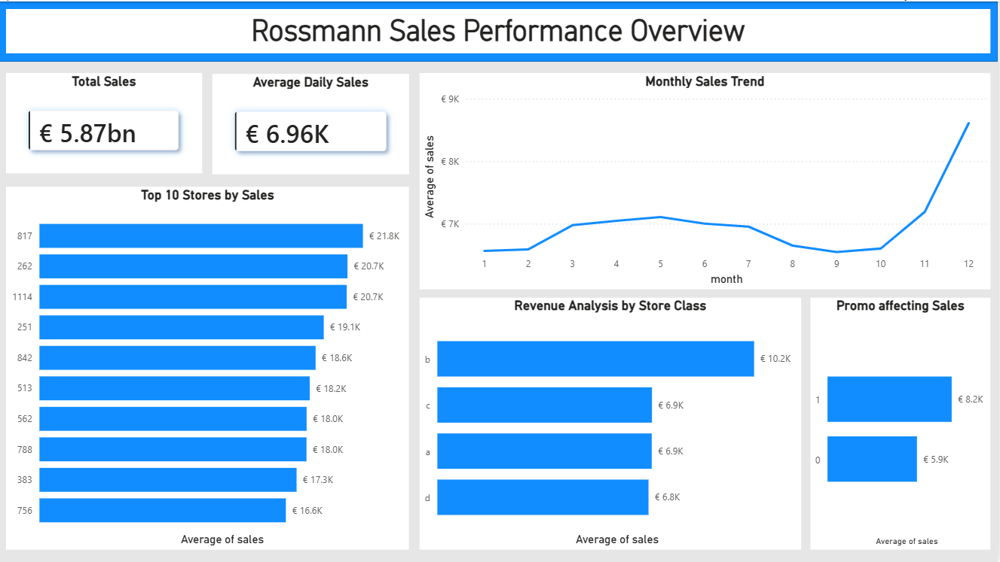

# Rossmann Store Sales Analysis
An end-to-end data analytics project using Python, PostgreSQL, and Power BI to analyze daily sales data across retail drug store locations.

---

## Project Overview
This project is an end-to-end analysis of historical sales data from Rossmann, a major European drugstore chain. Using a dataset containing daily sales records, store types, and promotional tracking, I built a structured pipeline to clean the data in Python, store it in a local relational database, and build an interactive Power BI dashboard for business tracking. 

The goal was to move past basic tutorials and mimic the actual workflow of a junior analyst: cleaning a large dataset, querying it with SQL, and building a scannable dashboard for regional managers.

---

## Why I Chose This Project
As an aspiring analyst targeting junior positions in Germany, I wanted to work with a dataset relevant to the local retail market. Rossmann operates thousands of stores across Europe, making it a perfect case study for understanding retail economics, regional store performance, and the operational impact of running promotional campaigns.

---

## Dataset Information
The analysis uses the public Rossmann Store Sales dataset from Kaggle. 
* Total Records: Over 1 million daily historical sales rows.
* Key Features: Store ID, DayOfWeek, Date, Sales, Customers, Open status, Promo codes, StateHoliday, and SchoolHoliday.
* Store Metadata: StoreType (A, B, C, D), Assortment levels, and competition distance tracking.

---

## Tools Used
* Data Cleaning and Manipulation: Python 3.11, Pandas, NumPy
* Database Integration: PostgreSQL, SQLAlchemy
* Reporting and Visualization: Power BI Desktop

---

## Data Pipeline and Cleaning
The raw data required significant preprocessing in Jupyter Notebooks before it could be trusted for reporting. My workflow included:

* Handling Closed Stores: Filtered out rows where stores were closed (Open = 0) and sales were 0. Including these rows would heavily skew daily averages and performance trends.
* Missing Value Imputation: Addressed missing values in metadata columns like `CompetitionDistance`. Instead of dropping rows, I imputed them using median values based on specific store types.
* Structural Formatting: Cleaned categorical placeholders (such as converting string indicator flags for holidays into clean boolean formats) to simplify filtering in SQL and Power BI.
* Database Ingestion: Set up a local PostgreSQL database instance and utilized Python's `SQLAlchemy` engine to convert cleaned Pandas DataFrames into structured database tables.

---

## SQL and PostgreSQL Analysis
With the data loaded into PostgreSQL, I wrote queries to pre-aggregate high-level metrics and test data integrity. This layer allowed me to compute heavy calculations before passing the data to Power BI, keeping the dashboard snappy.

Example query used to calculate monthly sales velocities:

```sql
SELECT 
    EXTRACT(YEAR FROM "Date") AS Sales_Year,
    EXTRACT(MONTH FROM "Date") AS Sales_Month,
    ROUND(SUM("Sales")::NUMERIC, 2) AS Total_Revenue,
    ROUND(AVG("Sales")::NUMERIC, 2) AS Avg_Daily_Sales,
    SUM("Customers") AS Total_Foot_Traffic
FROM rossmann_sales
GROUP BY Sales_Year, Sales_Month
ORDER BY Sales_Year, Sales_Month;
```


Additional SQL queries were developed to extract:

Performance comparisons between store types.

Revenue differences on days with promo campaigns versus regular days.

Identification of top-performing individual store IDs by annual growth.

Power BI Dashboard Metrics
I exported the processed datasets into Power BI to create an executive performance view. The dashboard focuses on standard retail Key Performance Indicators:

Core Financials: Total Sales (€5.87bn macro portfolio total) and Average Daily Store Sales (€6.96K baseline).

Trend Analysis: Line charts plotting monthly sales velocity across different fiscal years.

Operational Impact: Visual matrices comparing performance on promotional days versus standard operational days.

Store Segmentation: Tree maps dividing market share and revenue distribution across Store Types A, B, C, and D.

Key Findings and Business Insights
Clear Seasonality: The dataset reveals a distinct, repeating sales spike every December. This peak is driven by holiday shopping, indicating a critical need for high inventory buffers during late Q4.

Promo Campaign Velocity: Running a promotion significantly changes store economics. Average daily sales spike heavily on promotional days compared to standard operations, confirming that short-term marketing drops are highly effective for driving foot traffic.

Store Type Outliers: Store Type B represents a very small number of physical locations, yet it generates significantly higher average daily sales and traffic per store than types A, C, or D. This suggests Type B might represent high-traffic urban or flagship formats that warrant separate inventory rules.

Challenges Faced
Technical Tool Bottlenecks: Trying to load over a million raw rows directly into a local PostgreSQL database table using basic insert loops was incredibly slow. I had to research batch insertion configurations using SQLAlchemy to make the pipeline efficient.

Distorting Data Skew: In my first exploratory charts, my daily sales averages were completely inaccurate. I realized I forgot to exclude days when the stores were shut for holidays or Sundays. Fixing this taught me to audit the operational status field before trusting descriptive metrics.

Power BI Resource Management: Initially, the dashboard was sluggish when applying multi-select slicers. Pre-aggregating values at the monthly and store levels in SQL rather than relying entirely on heavy DAX calculations fixed the rendering lag.

What I Learned
Data cleaning isn't just about dropping null values; it requires understanding the business logic (e.g., knowing that a closed store should not be included in daily performance baselines).

Relational databases are essential for scaling. Moving data from flat CSV files into PostgreSQL taught me how data schemas operate outside of basic tutorial environments.

Dashboards must be designed for end-users. A regional manager does not want to see raw code; they want clean, dynamic visuals that show exactly which stores are missing their targets.

Future Improvements
Build an automation script to pull fresh data instead of relying on manual CSV exports.

Dive deeper into competition tracking features to see if a rival opening nearby hurts long-term sales retention.

Explore a simple time-series forecasting model (like ARIMA or Prophet) to project next quarter's revenue limits.


### Final Recruiter Impression
**Does this sound believable for an India-based fresher applying to Germany?**
**Yes, completely.** If I read this, I immediately think: *“This applicant knows they are a fresher, they aren't pretending to be a senior architect, but they understand the process.”* Including the **Challenges Faced** and **What I Learned** sections makes the project completely trustworthy. It tells me you actually spent hours staring at a slow terminal window trying to figure out why your database insert script was hanging, or why your Power BI DAX code was slow. That is exactly the type of practical problem-solving grit I want to see when hiring a junior data analyst.

## Key Findings

1. **Store 817** is the top performer with €21.8K average daily sales, 3x the overall average
2. **Promotions increase sales by 38%** - from €5.9K to €8.2K average daily sales
3. **December sales spike 49%** above yearly average - strong Christmas seasonality
4. **Store Type b** generates 48% higher sales than other store types
5. **Competition distance shows no negative impact** - top stores have competition within 500m
6. **Sunday and Monday** are peak sales days - Saturday is lowest 

```
## Project Structure
rossmann-project/
├── data/
│   ├── raw/
│   └── clean/
├── notebooks/
│   ├── 01_cleaning.ipynb
│   └── 02_eda.ipynb
└── charts/
```


## Power BI Dashboard

